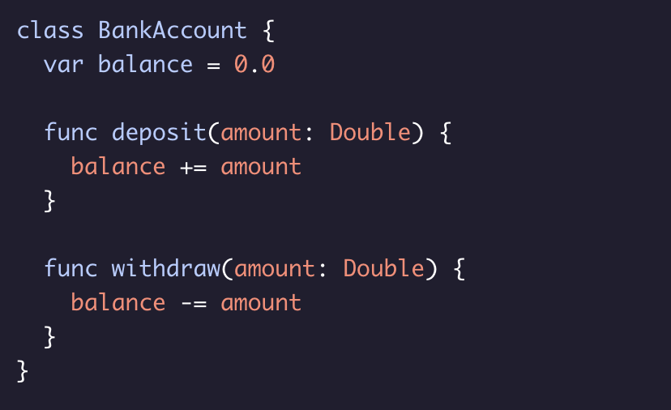
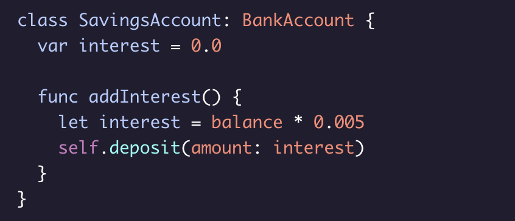

# Inheritance

When one class takes on the properties and methods from another class.

When one class inherits from another: 
  * The new inheriting class is known as a subclass.
  * The class it inherits from is known as its superclass.

To create a class that inherits from another, we put the name of the class we’re inheriting from (superclass) after the name of the class we’re creating (subclass).

Syntax Example:

Working Example:

The *BankAccount* class has:
  * a ***.balance*** property that stores the amount of money.
  * a ***.deposit()*** method that adds to the balance.
  * a ***.withdraw()*** method that takes from the balance

    

And you want a new SavingsAccount class that inherits from BankAccount:

Here, the new ***SavingsAccount*** class (subclass) automatically gains all of the characteristics of ***BankAccount*** class (superclass), such as its ***.balance*** property and its ***.deposit()*** and .***withdraw()*** methods.

the ***SavingsAccount*** class defines the following:
  * a ***.interest*** property that stores the interest rate
  * a ***.addInterest()*** method that deposits the interest

And only ***SavingsAccount*** instances will have these.