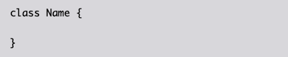
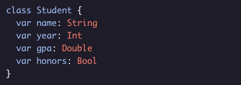

# Creating a Class

Here’s the basic syntax for creating a class:

  * The *class* keyword followed by a class name creates the class.
  * Class name is capitalized.
  * Just like structures, classes also contain both properties and methods.

  Example: 

  

The *Student* class has four properties:

  * *.name* of the type *String*.
  * *.year* of the type *Int*.
  * *.gpa* of the type *Double*.
  * *.honors* of the type *Bool*.

You can also use Swift's default property values so that *Student* class can have predefined values inside the class:

