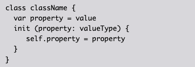
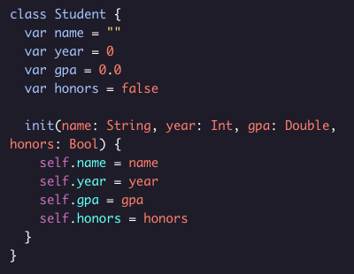

# The Init Method

if we know that our class instances vary a lot from one to another, we can include an *init()* method for customization. 

Example Syntax:

Note:
  * It doesn't require the ***func*** keyword.
  * Gets called upon instance creation.
  * the ***init()*** method uses the ***self*** keyword to reference itself.

Example Init():

Now you can create an instance of the ***Student*** class and initialize its propertiesin one line:

