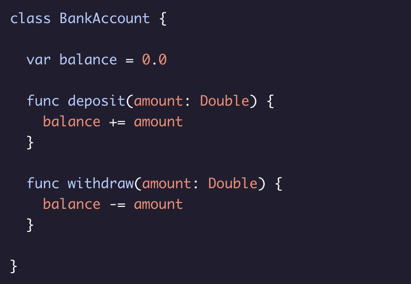
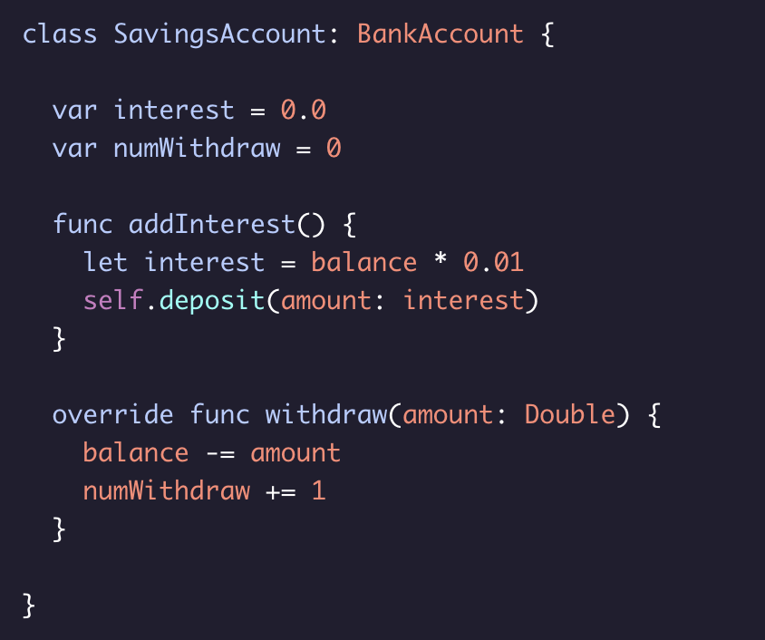

# Overriding Methods

To override a method, you can redeclare it in the subclass and add the override keyword to let the compiler know that you aren’t accidentally creating a method with the same name as the one in the parent class.

Working Example:

Suppose you want a new ***SavingsAccount*** class and you want to override the ***.withdraw()*** method from its superclass BankAccount:

Here, the new .withdraw() method not only subtracts amount from balance, but it also increments numWithdraw.