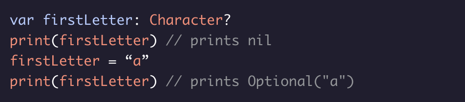
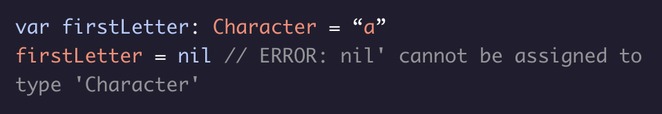

# Intro to Optionals

An *optional* represents a variable that might be absent. 

Optional types either contain a value or nil. An optional type is defined with a question mark:

Optionals can be assigned to either *nil* or an instance of the optional type. Its initial value will be nil unless you assign a value yourself:

Only optional types can be assigned to nil. If you attempt to assign a non-optional type to nil, you will get a compile-time error.

