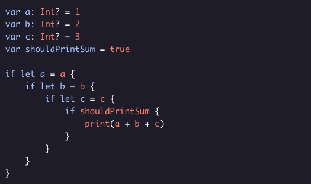
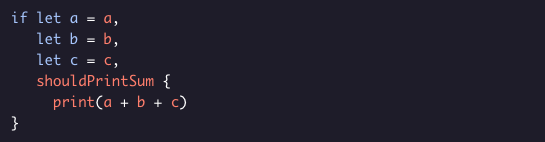

# Multipe Optoinal Bindings

*if let* statements are a great way to safely handle optional values. Sometimes, we might have a lot of optionals we need to unwrap! This can get very indented:

Developers sometimes call this nested structure a Pyramid of Doom because it looks kind of like a sideways pyramid. To avoid these, Swift allows us to bind multiple variables with a single *if let* statement.

Much easier to read! If all of the optionals are not *nil* and all of the bools are true, then the body is entered. Otherwise, that block is skipped. If the *if let* line becomes too long, you can break it up into multiple lines:

