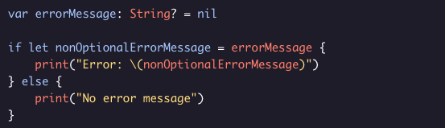
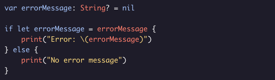

# Optional Binding

Using optional binding, you can check if a value is not *nil* in an if statement, then make a new constant that stores the underlying value.

If *errorMessage* is not *nil*, a new constant *nonOptionalErrorMessage* of type *String* is created. Then the error message is printed. If *errorMessage* is *nil*, *nonOptionalErrorMessage* is never declared and the code in the else block is executed.

It’s common practice to use the same name for the new constant as the original optional variable.

In the body of the *if let* statement, *errorMessage* refers to the newly created constant of type *String*.