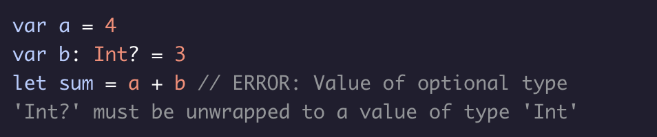
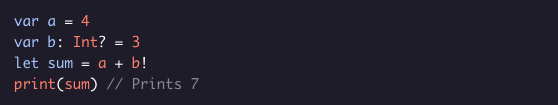
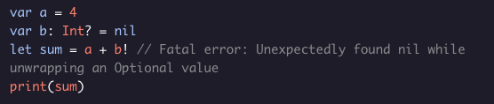
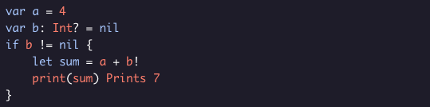

# Unwrapping Optionals

Once you’ve created an optional, you’ll want to be able to access the value inside. However, if you just try to use the optional, you will get a compile-time error:

The easiest way to wrap an optional is using the ! operator. This process is called **force unwrapping** and will break open the optional and let you use the underlying value:

If the underlying value is *nil*, your program will crash:

Make sure to only use the *!* operator if you are absolutely sure that the value isn’t nil. To be safe, you can check using an if statement:

