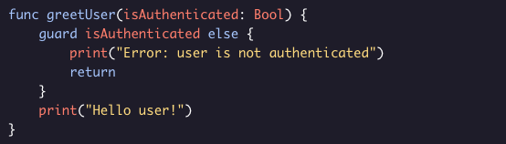
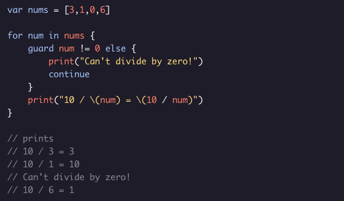
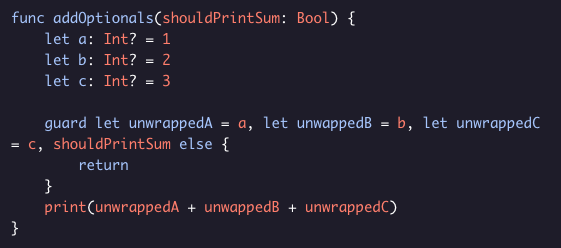

###### OPTIONALS
# Guard Statements

*Guard statements* give us another way to avoid overly nested code. A guard statement has the following form:

One way to read this guard statement is: “Make sure that *userAuthenticated* is true. If it’s false, print “Error: user is not authenticated” and return. If it’s true, continue executing the rest of the code.”

Unlike if statements, a guard statement **must** have an else statement. The else statement after a *guard* has to exit the current scope. Guard statements can be used to exit the scope of loops as well:

Guard statements can also be used to bind optionals just like with *if let* statements. They also support multiple assignments:

