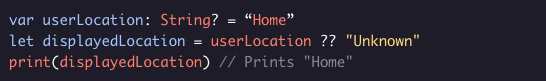
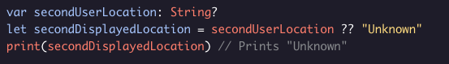

##### OPTIONALS
# The Nil-Coalescing Operator

The *nil-coalescing operator* gives us another way to handle optional values by allowing us to provide a default value if the optional is nil. *nil-coalescing* uses the syntax ***optionalVal ?? defaultValue*** where ***optionalVal*** is some optional and ***defaultValue*** is the same type as the optional’s underlying type. If ***optionalVal*** is non-nil, this expression evaluates to ***optionalVal!***.

If *optionalVal* is nil, this expression instead evaluates to *defaultValue*

The nil-coalescing operator is great for giving a quick default value to an optional!