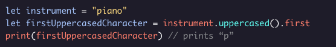
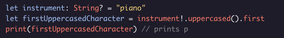
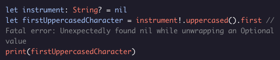
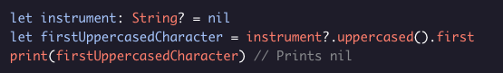
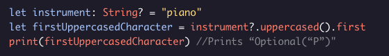

##### OPTIONALS
# Optional Chaining

It’s common in Swift to chain properties and method calls on a variable:

But what if the variable is an optional? We can use the *!* operator to force unwrap the optional:

But this will crash if the optional is nil:

Fortunately Swift gives us a way to safely chain different calls on an optional using *optional chaining*. By replacing the ***!*** operator with the ***?*** operator, our code can no longer crash. If the optional is ***nil***, then the entire expression will evaluate to ***nil***.

If the optional is not ***nil***, then it will be unwrapped and have the subsequent properties and methods called on it. Note that because the entire expression can be nil, it now evaluates to an optional as well:

