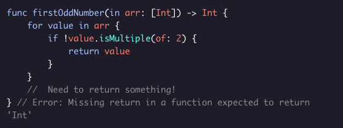
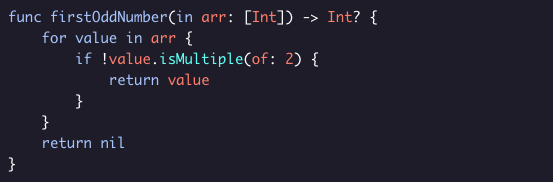

##### OPTIONALS
# Optionals And Functions

Because optionals are types just like *Arrays* and *Strings* are, we can use them in the signature of a function. Optionals are useful because when writing some functions, you might not have a good value to return.

What number should ***firstOddNumber(in:)*** return if we pass in ***[2,4,6]***? In many languages, functions return ***-1*** if they don’t have a good answer to the question. But here, that would be pretty confusing because in the array ***[2, 8,-1, 5], -1*** is the first odd number!

Fortunately, optionals give us a good solution to this problem. By returning an optional integer, we can make it clear that there was no good answer to the question:

