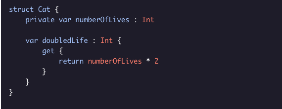
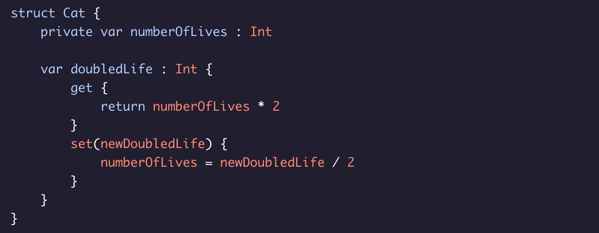
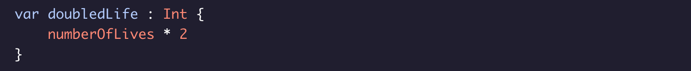
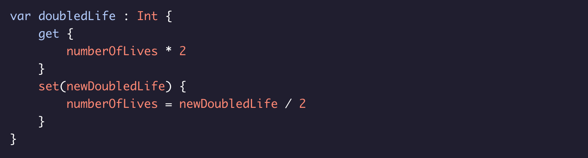
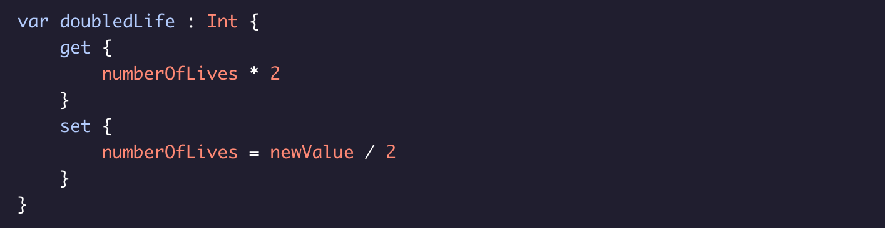

# Creating Setters for Computed Properites

Computed properties don’t store values directly, so you need to actually set the underlying stored properties that the computed property is derived from.

### Example:

The easiest way to create a setter is to use the getter as an equation:

Now solve for the ``numberOfLives`` by dividing both sides by two:

You can complete the syntax for the setter using the ``set`` key word.
This will also pass in the new value of the computed property.
### note: 
This can be named anything.

For this example it will be called ``newDoubledLife`` for clarity:

Key details:
* The ``set`` keyword begins the setter definition.
* The ``newDoubledLife`` parameter passes in the new value that is being assigned to ``doubledLife``.
* In the example, it set the underlying stored property ``numberOfLives`` which ``doubledLife`` is derived from.

### Shorthand Forms

* Read-only computed properties can omit the ``get`` key word:

* Computed properties witha a getter and setter can omit the ``return`` IF the entire body of the getter is a single experession:

* You can omit the passed parameter on the setter and use the default ``newVaule`` that is provide to you:

