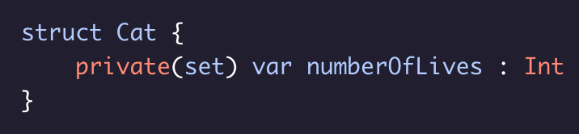
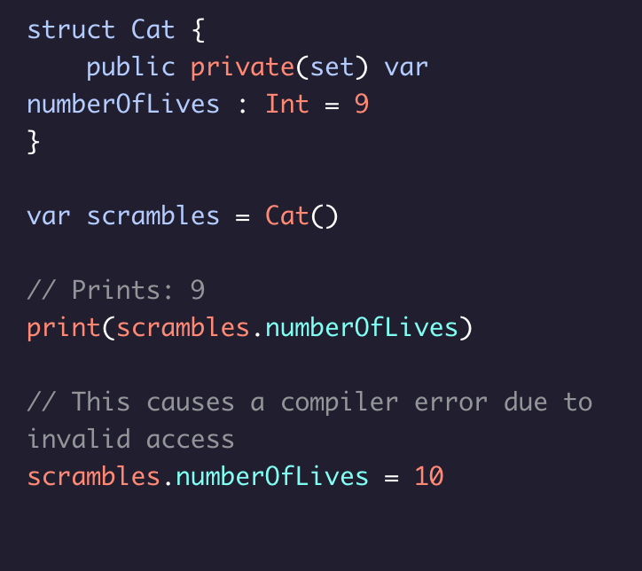

# Implementing a Private Setter

A private setter allows us to limit write access to within the scope of the ``struct`` but still allow the property to be read outside of the ``struct``.

Use the ``(set)`` keyword when you want declare a private setter:

In this example, you are declaring the setter to have private level access, while the getter will be the default ``internal`` level access.

### Note:
* You could also declare the ``numberOfLives`` variable this way:

This gives the getter for ``numberOfLives`` public level access, while the setter has private level access.

### Note: 
* Any combination of access levels can be declared, as long as the setter has the lower access level than the getter.

For example:

* ``open fileprivate(set)`` is a VALID access level.
* ``private internal(set)`` is an INVALID access level.

