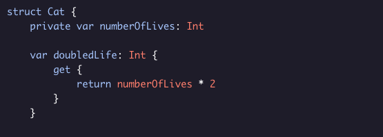
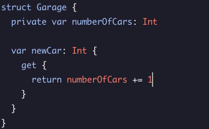

# Computed Properites

Computed properties are a special type of property that don’t actually store a value directly, rather use other properties and constants to compute and return a value.

### Example code:

* Here doubleLife is ``decalared`` as an ``Int`` type.
* The brackets after the type give us a scope for the getter.
* The ``get`` keyword defines the getter.
* The ``return`` keyword end the scope of the getter and returns a final value.

### Use Cases: 
A read-only computed property can be useful in cases where you want to safely give read access to some property but want to be sure it can’t be modified.

### Note:
* Computed properties aren’t limited to private properties and can include properties of any access control level.

* Computed properties don’t have type inference therefore we must explicitly define their type.