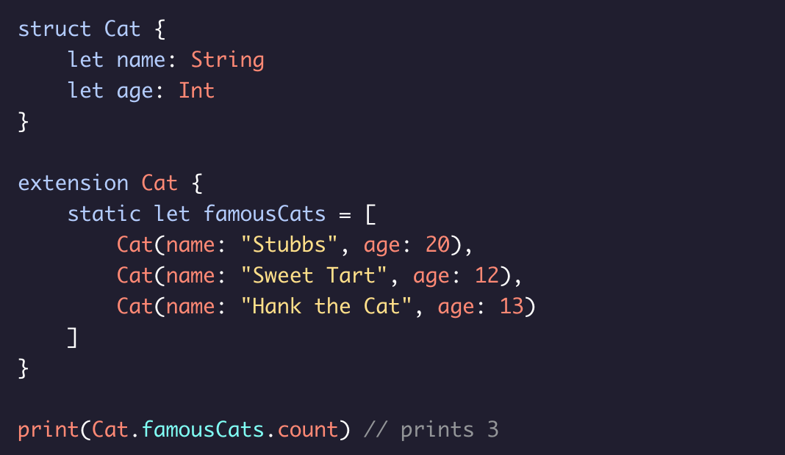
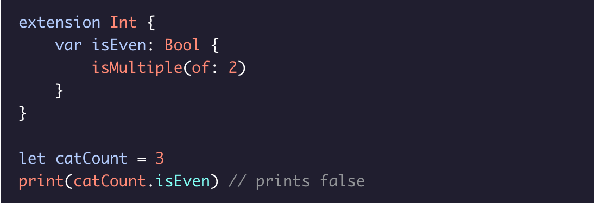
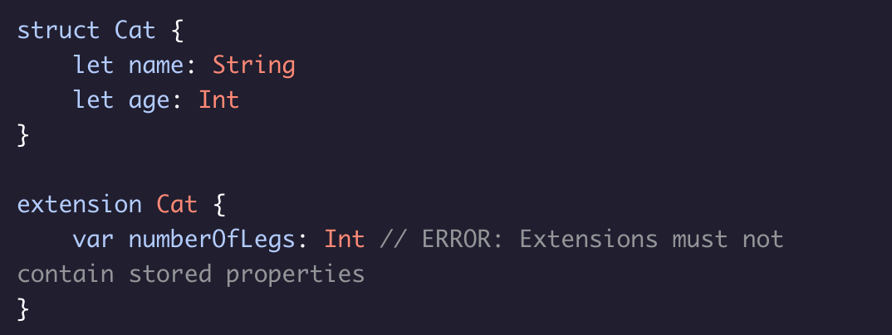
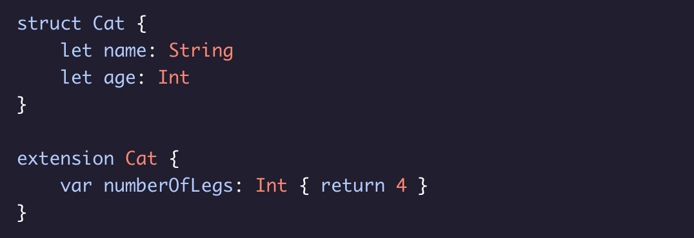

### Extensions

By using an **extension**, you can continue writing the definition of a struct, class or enum anywhere in your codebase.

### Note:
* Code that is written in an extension will behave exactly the same as if it was defined in the original struct.
* You can exten structs, classes, and enums.

WHAT YOU CAN'T DO:
* In extension you cannot create stored properties:

* This restriction ensures that adding an extension to your code will never cause your code to not compile by adding new requirments.

  * Instead add computed properties:
  