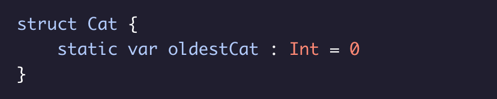
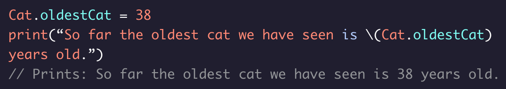
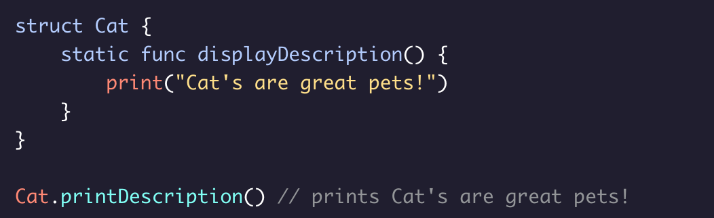

# Defining a Type Property

Defining a property that is associated ***directly*** with the ``struct`` itself is known as a *type property*.

### Things to know:
* When there is some value that you want to be consistant regardless of any instance of the ``struct``.
* It can be a **constant** or a **variable**.
* Usually, the value is associated with that type of object for a specific logical or informational reason.
    * For Example:
``Double.pi`` is a type property that retrieves the value of pi from the built-in ``Double`` structure in Swift.

### For Example:
Let’s say we want to create a variable type property that stores the value of ``oldestCat``. It will be updated when a specific cat breaks the age record, but it will hold true across all cats. We define a type property using the ``static`` keyword:

Since type properties aren’t tied to any instance of the struct, we use dot syntax on the type itself to access them:

Methods can also be declared as ``static``. These are called on the class, structure, or enumeration itself rather than an instance.

