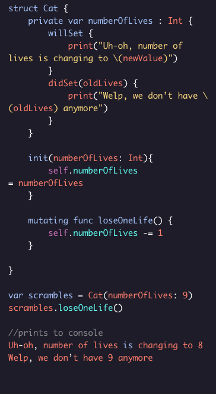

# Using Proper Observers

Property observers let us know wehn observed properties are about to be or have been modified.

## Observing a stored property

TWO methods can be used:
* ``willSet``
* ``didSet``

When they are used:
* ``willSet`` is called right before you set the property.
* ``didSet`` is called right afterward.

In the Scope of ``willSet``, you are given the new value that the property will be set to with the default parameter name ``newValue``.

* You can also define a custom name for the new value.

In ``didSet``, it gives you the old value that was previously assigned to the property, with the default name ``oldValue``.

* This can be overriden with a custom name too.

## Here is an example:

### Things to note
* you could have used a custom value for ``willSet``.
* You could have also used the default value of ``oldValue`` in ``didSet``.