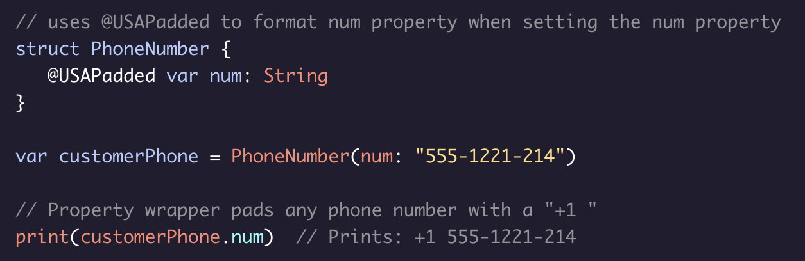

# Property Wrappers

A ***property wrapper*** is a special bit of syntax that is added when defining a structure. In order to add the **@propertyWrapper** attribute, the structure needs to have a ***wrappedValue*** and an initializer that assigns the ***wrappedValue***.

Below is an example of using a property wrapper to format a phone number with the USA country code.

Whenever you want to use a property wrapper to wrap a certain property, precede the property with an @ symbol and the property wrapper name:

