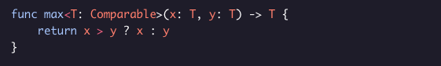
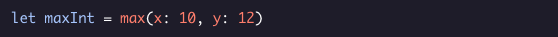
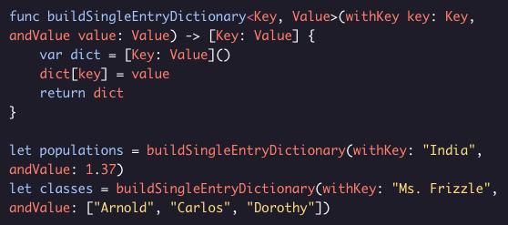

# Generic Functions 

They allow us to create functions that make few assumptions about the underlying data types of its arguments and can be used with multiple data types.

Using Generics, you can construct a function that accepts both Ints and Doubles.

The function name *max* is accompanied by *<T: Comparable>*. *T* denotes the placeholder data type and is enclosed within angular brackets.

*: Comparable* shows that *T* conforms to the *Comparable* protocol but we don’t know *T*’s exact type. Conformance to *Comparable* is necessary in this case because it guarantees that values *x* and *y* can be compared with each other. 

Both *Int* and *Double* conform to *Comparable*, so this function can be used with both *Int* and *Double* types. However, both arguments have to be of the same type.

This is how the function can be called with *Int* values:

And this is how it can be called with *Double* values:

It is also possible to have generic functions that allow different data types in their arguments.

