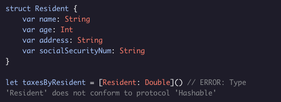

# Hashable Protocol

Swift standard library includes many useful protocols that you can have your structures, classes, or enums conform to. A useful example is ***Hashable***.

The *Hashable* protocol is used to make structs, classes, and enums able to be added to *Set*s and *Dictionaries*. To conform to *Hashable*, a struct, class, or enum either needs to have a *hashValue* property or to have only properties that already conform to *Hashable*. Most basic Swift types conform to Hashable. The following code won’t compile:

You can make this code compile by adding the Hashable protocol to *Resident*:

