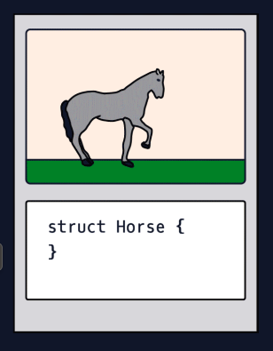
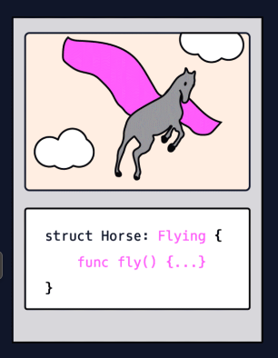

# Protcols and Generics

A ***protocol*** is a set of standards that classes, structs, or enums can choose to implement in their own ways. These standards come in the form of properties and functions.

When a struct conforms to a protocol, it must implement a set of methods or properties, then it gains a set of abilities.

***Generics*** allow developers to write functions, classes, structs, and enums that can use different data types.

  * An ***Array*** is a generic structure because you can make an Array of Strings, Ints, or any other type.

## Example

