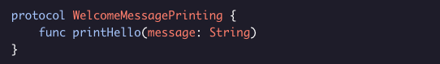
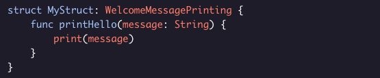
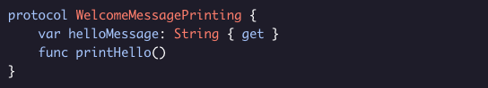
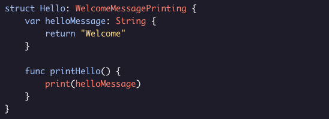
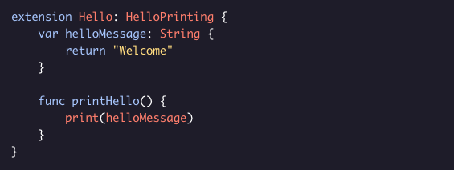
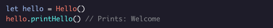
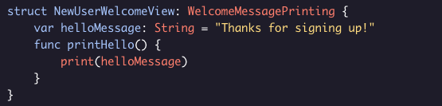
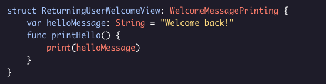
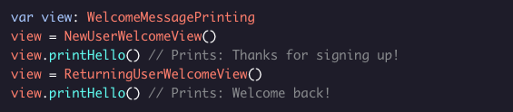

# Protocols

A protocol defines a blueprint or a set of requirements that are needed to accomplish a particular task. Classes, structs, and enums can conform to protocols by providing an implementation of the protocol’s functions and properties.

The definitions of protocols are very similar to classes and structs. However, in the case of protocols, the definition does not implement the properties and functions. Instead, the class or struct that adopts the protocol handles the implementation of the properties and methods. Any type that satisfies the requirements of the protocol as described above is said to conform to the protocol.

In the example above, we have a protocol named *WelcomeMessagePrinting*. Inside the protocol, there is a function called *printHello()*. This function would be implemented by the class or struct that adopts WelcomeMessagePrinting.

Properties can also be part of protocols.

### Important things to know:
  * The protocol definition must specify if the conforming class/struct/enum needs to implement just the getter for the property or both the getter and setter methods.
  
  * If the property is defined as get, then the conforming type can choose to either provide the getter method, which is the minimum requirement or provide both the getter and setter methods.

Let’s now create a struct that conforms to ***WelcomeMessagePrinting:***

Note that to add protocol conformance, the struct Hello needs to be followed by a : and the protocol name.

Sometimes protocols have multiple functions and the implementation can be long, so it is common to move the protocol implementation to a separate extension as follows:

The *printHello()* function can then be called as follows:

Multiple types can conform to the same protocol. For instance, in the following example we have *NewUserWelcomeView* struct conforming to ***WelcomeMessagePrinting:***

And then the *ReturningUserWelcomeView* also conforms to ***WelcomeMessagePrinting:***

Note that the *helloMessage* for the structs above are different - that’s the flexibility that protocols allow us.

We can invoke the *printHello()* function on instances of the structs as given below:

Note that view is declared as *WelcomeMessagePrinting* type, which means that it can be of any type that conforms to the *WelcomeMessagePrinting* protocol.