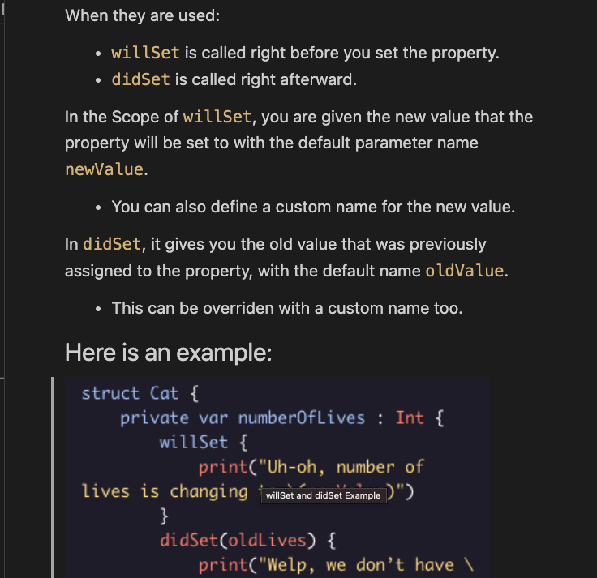

# swift_gallery
Swift gallery of syntax and common uses with examples. This is a way for me to remember and reference swift syntax.

I call each directory a gallery and each file a view. No real reason for this but to have some creative fun.

## Why I made this
The purpose of this repo is for me to be able to spend more time taking notes on how each concept works and be able to reference back to it. 

## Example of a gallery view:
Screen shot is from properites and access control

